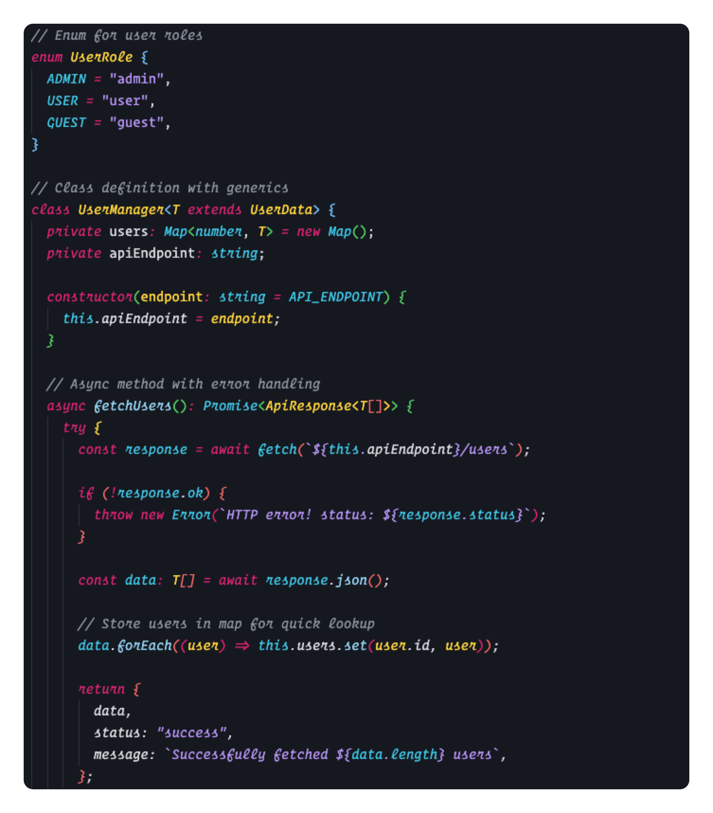
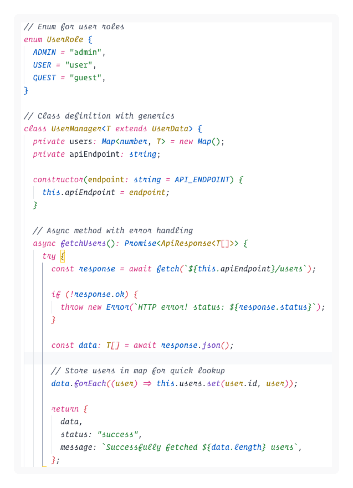

# Demo Time Theme


A vibrant and modern VS Code theme inspired by the colors of [Demo Time](https://demotime.show) - the ultimate tool for creating presentations and demos straight in your editor.

## 🎨 Theme Variants

This extension includes four beautiful theme variants:

- **Demo Time Dark (Italic)** – Sleek dark theme with italic styling for keywords and comments (default)
- **Demo Time Dark** – Same dark theme with standard (non-italic) styling
- **Demo Time Light (Italic)** – Clean light theme with italic styling for keywords and comments (default)
- **Demo Time Light** – Same light theme with standard (non-italic) styling

Each theme comes in both regular and italic versions, so you can choose the style that best fits your coding preferences.

### Preview

#### Dark Theme



#### Light Theme



## ✨ Features

- **Carefully crafted color palette** inspired by Demo Time's brand colors
- **Excellent contrast** for improved readability and reduced eye strain
- **Comprehensive syntax highlighting** supporting multiple programming languages
- **Consistent design** across all VS Code UI elements
- **Optimized for demos** - making your code look great during presentations

## 🚀 Installation

### Via VS Code Marketplace

1. Open VS Code
2. Go to Extensions (Ctrl+Shift+X / Cmd+Shift+X)
3. Search for "Demo Time Theme"
4. Click Install
5. Go to File > Preferences > Color Theme
6. Select "Demo Time Dark" or "Demo Time Light"

### Via Command Line

```bash
code --install-extension eliostruyf.vscode-demotime-theme
```

## 🎨 Color Palette

### Dark Theme

- **Background**: `#15181f`
- **Foreground**: `#eaeef6`
- **Accent**: `#ffd43b`
- **Secondary**: `#202736`
- **Highlight**: `#a08000`

### Light Theme

- **Background**: `#ffffff`
- **Foreground**: `#202736`
- **Accent**: `#ffd43b`
- **Secondary**: `#f4f6fa`
- **Highlight**: `#a08000`

## 💡 About Demo Time

[Demo Time](https://demotime.show) is a revolutionary platform that helps you create stunning product demonstrations. This theme captures the essence of Demo Time's modern, professional, and vibrant aesthetic - perfect for developers who want their code to look as polished as their demos.

## 🐛 Issues & Feedback

Found a bug or have a suggestion? We'd love to hear from you!

- 🐛 [Report an issue](https://github.com/estruyf/vscode-demo-time-theme/issues)
- 💡 [Request a feature](https://github.com/estruyf/vscode-demo-time-theme/issues)
- ⭐ [Rate this extension](https://marketplace.visualstudio.com/items?itemName=eliostruyf.vscode-demotime-theme)

## 🤝 Contributing

Contributions are welcome! Please feel free to submit a Pull Request.

## 📝 License

This project is licensed under the MIT License - see the [LICENSE](LICENSE) file for details.

## 🙏 Acknowledgments

- Inspired by the beautiful design of [Demo Time](https://demotime.show)
- Built with ❤️ for the VS Code community
- Special thanks to all contributors and users

---

**Enjoy coding with Demo Time Theme!** 🚀

If you like this theme, consider checking out [Demo Time](https://demotime.show) for all your product demonstration needs.
